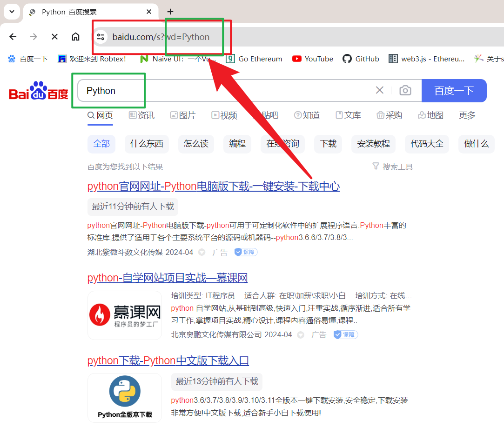
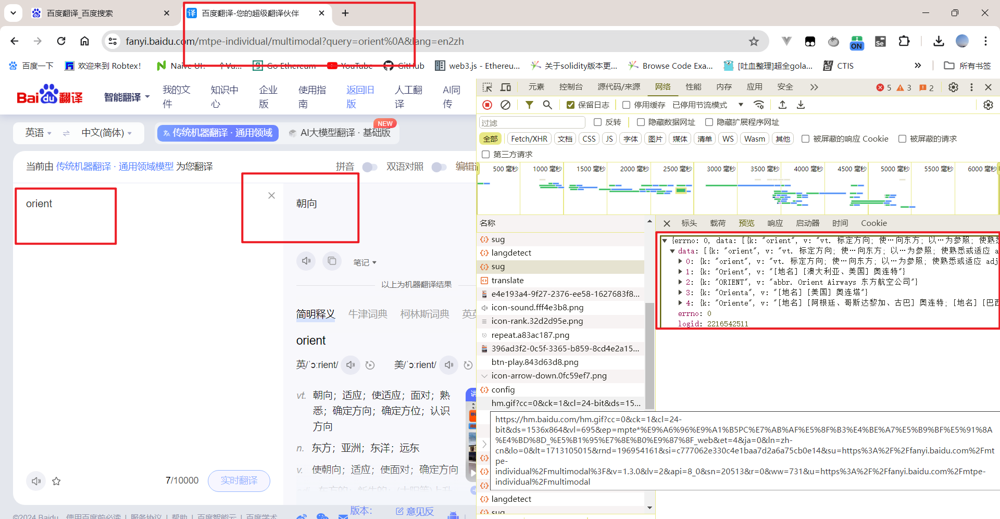

# 				Python_Crawler_Learning

------

## 一、爬虫

### 1、简介

​	网络爬虫是一种自动化程序，用于在互联网上收集信息。它们模拟人类在网络上浏览的行为，通过访问网页、提取数据和跟踪链接来获取信息。网络爬虫通常由搜索引擎、数据挖掘工程师、研究人员和开发者等使用。

### 2、核心工作

​	网络爬核心工作内容是去目标站点爬取网页，将网页中我们需要的内容进行解析，最后保存，比如保存到Excel，数据库等。

### 3、工作原理

（1）**选择起始点：** 网络爬虫需要一个起始点来开始它的搜索。这可以是一个单个网页、一组网页或整个网站。

（2）**抓取网页：** 爬虫会下载起始点网页的内容，并解析其中的 HTML 或其他标记语言，以识别其中的链接。

（3）**跟踪链接：** 爬虫会分析已下载的网页，提取其中的链接，并添加到待访问的链接列表中。

（4）**访问链接：** 爬虫会按照链接列表中的顺序，逐个访问链接，重复上述步骤，以获取更多的网页内容。

（5）**提取信息：** 爬虫在访问网页时会提取感兴趣的信息，如文本、图片、视频等，并将其存储或进一步处理。

（6）**存储数据：** 爬虫通常会将提取的数据存储在本地数据库或文件中，以备后续分析或展示。

### 4、网络爬虫的应用

​	网络爬虫的应用非常广泛，包括搜索引擎的网页索引、数据挖掘与分析、信息聚合、监测网站变化等。然而，网络爬虫也面临着一些挑战，如处理动态网页、遵守网站的使用条款与隐私政策、防止被反爬虫技术识别等。

### 5、Python的爬虫技术

（1）请求库：`urllib`、`requests`、`selenium`

（2）解析库：`正则`、`xpath`、`jsonpath`、`beautifulsoup`、`pyquery`

（3）存储库：文件、`MySQL`、`Mongodb`、`Redis`

（5）爬虫框架：`Scrapy`

## 二、Request网络请求库

1、简介

`requests` 是一个优雅而简洁的 Python HTTP 库，用于发送各种类型的 HTTP 请求。它是 Python 中最受欢迎的 HTTP 客户端库之一，因为它易于使用且功能强大。

2、安装

开源地址：https://github.com/psf/requests

中文官方文档：https://requests.readthedocs.io/projects/cn/zh_CN/latest/、

`Win+R`打开输入`cmd`，进入输入（后面的下载地址尽量跟上，要不然会出现下载超时情况）：

```shell
pip install requests -i https://pypi.tuna.tsinghua.edu.cn/simple
```

3、demo1【**get请求**】

获取百度网页的信息

```Python
# 引入库
import requests
#调用get方法获取网页
r = requests.get("http://www.baidu.com")
# 设置返回对象的编码
r.encoding = "utf-8"
# 返回响应状态码
print(r.status_code)
# 获取网页内容
print(r.text)
# 查看返回对象类型
print(type(r))
```

4、demo2【**get请求**】

实现百度对`Python`这个关键字的查询，并将查询到的页面进行一个反馈:



```python
import requests
url = "https://www.baidu.com/s"
#设置请求头，模拟浏览器正常访问
headers = {
'User-Agent': 'Mozilla/5.0 (Windows NT 10.0; Win64; x64) AppleWebKit/537.36 (KHTML, like Gecko) Chrome/123.0.0.0 Safari/537.36'
}
params = {
	'wd': 'Python'
}
r = requests.get(url=url, params=params, headers=headers)
print(r.url)
print(r.status_code)
print(r.text)
```

5、demo03【**post请求**】

在百度翻译输入`orient`发送Get请求，获取搜索的信息



```python
import requests
url = "https://fanyi.baidu.com/mtpe-individual/multimodal?"
#设置请求头，模拟浏览器正常访问
headers = {
'User-Agent': 'Mozilla/5.0 (Windows NT 10.0; Win64; x64) AppleWebKit/537.36 (KHTML, like Gecko) Chrome/123.0.0.0 Safari/537.36'
}
query={
    "query"="orient"
}
#post
r = requests.post(url=url, params=data, headers=headers)

print(r.url)

print(r.status_code)
#得到的是unicode编码类型的数据
print(r.text)
#json.loads方法自动把unicode编码转成中文
result = json.loads(r.text)
print(result)
```

